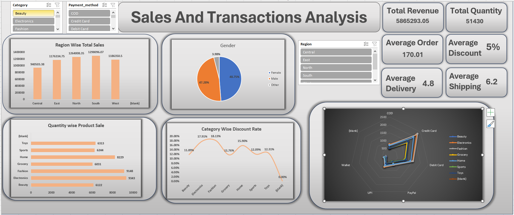

# E-commerce Sales & Transactions Analysis Dashboard

## 📊 Project Overview

This project features an interactive dashboard built in **Microsoft Excel** to analyze the sales performance and transaction data of an e-commerce business. The dashboard provides a comprehensive overview of key business metrics, enabling data-driven insights into regional sales, customer behavior, product performance, and discount strategies.

The analysis is based on a synthetic dataset containing **34,500 transaction records** across 17 features, simulating realistic online shopping data.

## 🖼️ Dashboard Preview

---

## 🚀 Key Features & Analysis Areas

The dashboard is designed for clarity and interactivity, allowing users to drill down into specific data points easily.

#### **Key Performance Indicators (KPIs)**
A top-level summary provides an at-a-glance view of the most critical business metrics:
* **Total Revenue:** The total sales amount generated.
* **Total Quantity:** The total number of items sold.
* **Average Order Value:** The average amount spent per order.
* **Average Discount:** The average discount percentage applied to orders.
* **Average Delivery Time:** The average number of days taken for delivery.
* **Average Shipping Cost:** The average cost of shipping per order.

#### **Visualizations**
* **Region-Wise Total Sales:** A bar chart that visualizes and compares sales revenue across different geographical regions.
* **Gender Distribution:** A pie chart showing the breakdown of sales by customer gender.
* **Quantity-Wise Product Sale:** A horizontal bar chart that ranks product categories based on the total quantity sold.
* **Category-Wise Discount Rate:** A line chart that analyzes the average discount percentage offered for each product category.
* **Payment Method vs. Category Analysis:** A radar chart that helps identify popular payment methods used for purchasing products across different categories.

#### **Interactivity**
* **Dynamic Slicers:** The dashboard includes slicers for **Category**, **Payment Method**, and **Region**. Selecting any option from these slicers will dynamically filter all charts and KPIs, allowing for focused and granular analysis.

---

## 💡 Key Insights

This dashboard reveals several critical insights into the business operations:

* **Top Performing Region:** The **West** region is the highest contributor to total sales revenue, indicating a strong market presence or higher purchasing power in that area.
* **Dominant Customer Segment:** The customer base is predominantly **Male**, accounting for approximately **67%** of the transactions. This insight can be crucial for targeted marketing campaigns.
* **Best-Selling Category by Volume:** **Fashion** products are the most frequently sold items by quantity, highlighting their popularity among customers.
* **Discount Strategy:** **Electronics** receive the highest average discount rate (around 17.5%). This may be a deliberate strategy to boost sales volume or compete in a price-sensitive market.
* **Data Quality Concern:** The presence of a **"(Blank)"** category in the "Region Wise Sales" and "Quantity Wise Product Sale" charts points to incomplete data in the source file. Addressing this data gap is essential for achieving more accurate analysis.

---

## ⚙️ How to Use

1.  Download the `sale&tran.xlsx` file from this repository.
2.  Open the file in a compatible version of Microsoft Excel (2016 or newer recommended).
3.  Use the slicers located at the top and right of the dashboard to filter the data.
4.  All charts and KPIs will update automatically to reflect your selections.
5.  Hover your mouse over any chart element to view detailed data points.
